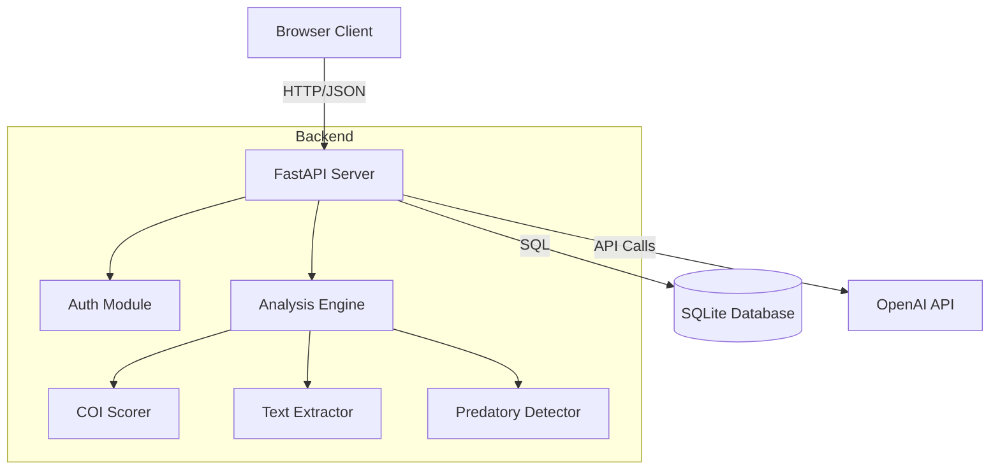
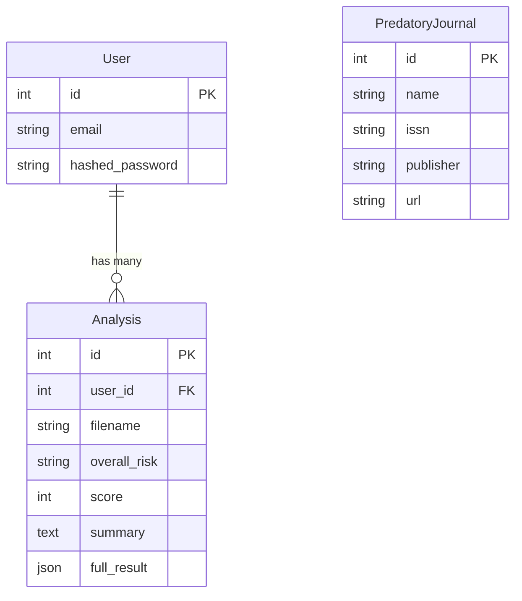

# Developer Guide

This document provides a deep dive into the technical architecture, core processes, and data models of the Research Integrity Project.

## 1. System Architecture

The application is built as a monolithic web application with a clear separation between the frontend (static assets) and backend (API).



### Tech Stack Details
-   **Framework**: FastAPI (Python 3.13+) for high-performance async API.
-   **Database**: SQLite with SQLAlchemy ORM.
-   **AI Integration**: OpenAI GPT-4o via `openai` python client.
-   **Frontend**: Vanilla HTML/JS/CSS served statically by FastAPI.

## 2. Core Processes

### 2.1. Analysis Pipeline
The core function of the app is analyzing PDF research papers. The pipeline flow is as follows:

1.  **Upload**: User uploads a PDF via `/api/analyze/pdf`.
2.  **Extraction**: `backend.engine.pdf_processor.extract_text_from_pdf` converts PDF to raw text.
3.  **Scoring**: `backend.engine.scorer.COIScorer` computes a risk score (0-100) based on 5 dimensions.
4.  **Summarization**: `backend.engine.llm_wrapper.LLMWrapper` sends the score and evidence to OpenAI to generate an executive summary.
5.  **Persistence**: The result (score, risk level, summary, full JSON) is saved to the `analyses` table.

### 2.2. Scoring Logic (The 5 Dimensions)
The `COIScorer` evaluates the paper across 5 specific dimensions. Each dimension contributes to the final score.

| Dimension | Weight | Description | Rules |
| :--- | :--- | :--- | :--- |
| **D1: Transparency** | 20% | Checks for presence of Funding and COI sections. | +100 if COI missing, +50 if Funding missing. |
| **D2: Funding Alignment** | 20% | Checks for commercial keywords in funding sources. | +80 if "pharma", "inc", etc. found in funding. |
| **D3: Network** | 20% | Checks author affiliations for commercial entities. | +60 if commercial affiliation detected. |
| **D4: Journal Integrity** | 20% | Checks against the Predatory Database. | **CRITICAL**: If predatory, score is forced to 100 (High Risk). |
| **D5: Bias** | 20% | Checks for promotional/sensationalist language. | +40 if words like "miracle", "perfect" are found. |

**Risk Levels:**
-   **Low**: 0 - 33
-   **Medium**: 34 - 66
-   **High**: 67 - 100

### 2.3. Predatory Journal Detection
Located in `backend.engine.predatory_detector`.
-   **Input**: Metadata extracted from the paper (Journal Name, Publisher).
-   **Process**: Queries the `predatory_journals` table.
-   **Logic**: Exact match or fuzzy match (if implemented) against known predatory entities.

## 3. Data Model

The database schema is defined in `backend.database.models`.



## 4. Directory Structure & Key Files

-   `backend/engine/scorer.py`: **Core Logic**. Contains the `COIScorer` class and the 5 dimension scoring functions.
-   `backend/engine/llm_wrapper.py`: **AI Interface**. Handles the prompt engineering and API calls to OpenAI.
-   `backend/api/api_v1/endpoints/analysis.py`: **Controller**. Orchestrates the upload -> process -> save flow.
-   `backend/scripts/scrape_issn.py`: **Data Ingestion**. Script to scrape and populate the `predatory_journals` table.

## 5. Setup & Development

### Environment Variables
Ensure `.env` is configured:
```bash
OPENAI_API_KEY=sk-...
SECRET_KEY=...
```

### Database Management
-   **Initialization**: Tables are created automatically on startup in `main.py`.
-   **Seeding**: Use `python backend/scripts/scrape_issn.py` to populate the predatory journal list.

### Running Tests
Run `pytest` in the root directory. Key tests:
-   `test_llm.py`: Verifies OpenAI connectivity.
-   `test_register.py`: Verifies user registration flow.
