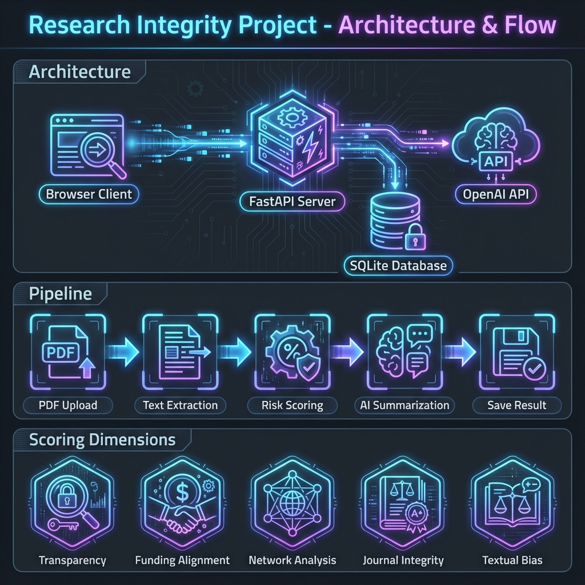
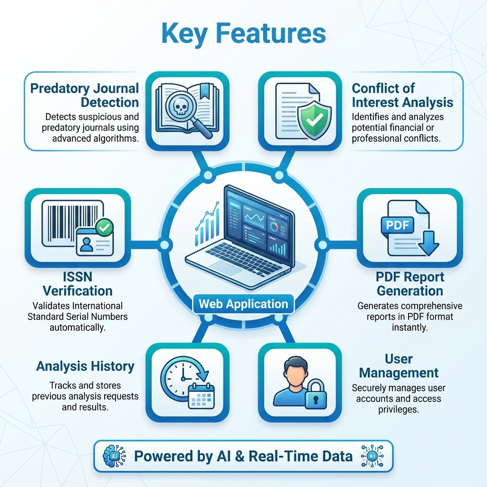

# 🛡️ Research Integrity Project



> **Empowering scientific integrity through AI-driven analysis and real-time data verification.**


---

## 📖 Overview

The **Research Integrity Project** is a cutting-edge web application designed to safeguard the quality of scientific research. By leveraging advanced AI and a comprehensive database of predatory publishers, it provides researchers and institutions with the tools they need to verify journal legitimacy and analyze potential conflicts of interest.

## ✨ Key Features



-   **🔍 Predatory Journal Detection**: Instantly check journals against a massive, constantly updated database of known predatory entities.
-   **🤖 AI-Powered COI Analysis**: Upload a PDF and let our AI engine analyze funding sources, affiliations, and disclosures to calculate a risk score.
-   **🆔 ISSN Verification**: Automated validation of Online and Print ISSNs to ensure journal authenticity.
-   **📊 Interactive Dashboard**: Track your analysis history and manage reports in a sleek, user-friendly interface.
-   **📄 PDF Reports**: Generate detailed, professional reports of your analyses for documentation and sharing.

---

## 🛠️ Tech Stack

| Component | Technology | Description |
| :--- | :--- | :--- |
| **Backend** |  **FastAPI** | High-performance async API handling core logic and database interactions. |
| **Frontend** |  **JS** | Responsive, static frontend served directly by FastAPI. |
| **Database** |  **SQLAlchemy** | Robust relational data storage for users, analyses, and journal data. |
| **AI Engine** |  | GPT-4o integration for semantic analysis and risk summarization. |

---

## 🚀 Getting Started

### Prerequisites

-   Python 3.13+
-   `pip`
-   OpenAI API Key

### Installation

1.  **Clone the repository**
    ```bash
    git clone <repository-url>
    cd RIA
    ```

2.  **Set up Virtual Environment**
    ```bash
    python3 -m venv venv
    source venv/bin/activate  # Windows: venv\Scripts\activate
    ```

3.  **Install Dependencies**
    ```bash
    pip install -r requirements.txt
    ```

4.  **Configure Environment**
    Create a `.env` file:
    ```env
    SECRET_KEY=your_secure_secret
    OPENAI_API_KEY=sk-your-openai-key
    ```

### Running the App

```bash
uvicorn backend.main:app --reload
```
Access the dashboard at: `http://127.0.0.1:8000`

---

## 📂 Project Structure

```
RIA/
├── 🧠 backend/          # Core Logic & API
│   ├── engine/          # Scorer, LLM, & Detectors
│   ├── api/             # REST Endpoints
│   └── database/        # Models & Schemas
├── 🎨 frontend/         # UI & Assets
├── 📚 RESOURCES/        # Data & Infographics
└── 📄 ria.db            # Database File
```

## 🕷️ Data Ingestion

The system includes a powerful scraper to populate the predatory journal database.

```bash
python3 backend/scripts/scrape_issn.py
```
*Note: This script merges data from Excel resources and enriches it with ISSNs found via web scraping.*

---

## 📚 Documentation

For more detailed information, please refer to:
-   [Developer Guide](DEVELOPER_GUIDE.md)
-   [PDF Documentation](Research_Integrity_Project_Guide.pdf)

---

<p align="center">
  Made with ❤️ for Science
</p>
